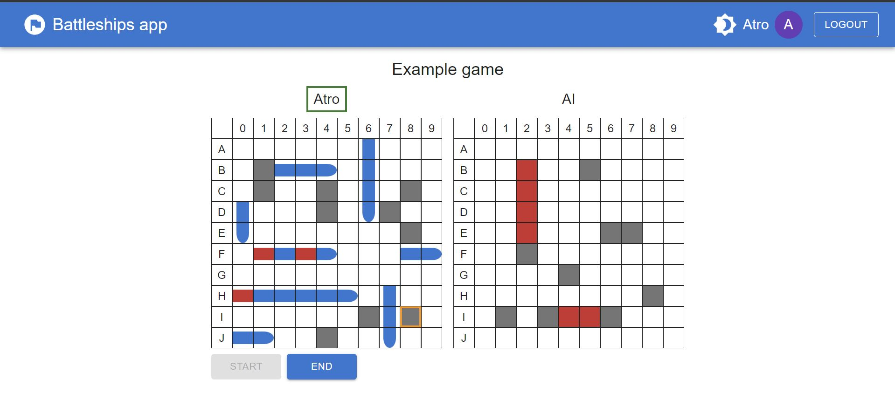

# Battleships app

## Description

This project is an application of the Battleships board game [https://en.wikipedia.org/wiki/Battleship_(game)]. The main application features are:

- Battleships game
- Player vs Player and Player vs PC game modes
- Persistent storage for users and games so all actions are saved
- Game rooms
- Authentication
- Support for desktop and mobile use

The application is hosted in Github Pages and Fly.io and can be tested online from https://atrokarvinen.github.io/battleships



### Technologies

This project has been a learning opportunity for me and it's the first NodeJS application I've made. Here are some key technologies about the application:

- NodeJS with Express as the backend server 
- React with Material UI as the frontend
- MongoDB as the database with Mongoose as the ODM
- Typescript is used for both backend and frontend
- Socket.io for bidirectional communication
- Jest for unit and integration testing
- Playwright for end-to-end testing
- Github Actions and Fly.io for CI/CD and deployment

## Local setup

The project has separate client and server programs which are in their corresponding folder. 

### Server setup

The server requires `.env` file with environment variables. There is a `.env_example` file which lists all the assumed environment variable names. Set these to correspond to your local environment.

Secondly, the server requires access to a Mongo Db server for database access. Set the connection string environment variable to point to a valid Mongo Db server.

Lastly, install npm packages and start the app.

``` bash
npm i;
npm start;
``` 

### Client setup

Similarly to server, client requires `.env` file with environment variables which can be created from the `.env_example file`. 

Then, install npm packages and start the client

``` bash
npm i;
npm start;
``` 

### Starting both server and client together

After initial setup, both server and client can be started with a single command.
On the root level, run on the first time `npm i` to install packages required for parallel startup.
Then, run `npm start`  which starts both server and client together.